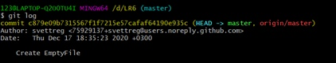

##ОТЧЁТ О ЛАБОРАТОРНОЙ РАБОТЕ №6 
## ПО ОСНОВАМ ПРОГРАММИРОВАНИЯ

###Ход работы:
На сайте GitHub делаем копию https://github.com/Kurtyanik/LR6/ через форк

С помощью команды _cd D:/_ в консоли Git Bash переходим на диск D, создаем папку lab6 (_mkdir lab6_) и переходим в нее по команде _cd_

Используем команду _git init_ для инициализации гит в данной папке. Затем связываем локальный и удаленный гит командой _git remote add origin_ и клонируем в папку lab6 

Добавляем новый пустой файл "newFile.txt" через сайт github.com.  Подгружаем изменения с удаленного репозитория

Через _git log_ выводим все изменения

Получаем подробную информацию о последнем изменении

Создаем и переходим в ветку **branch1* командой git checkout -b origin/branch1

Возвращаемся в ветку master и производим слияние. Перед этим необходимо исправить файл mergefile.txt для удаления противоречивой информации. Отправляем через push данные на удаленные репозиторий. 

Добавляем пустой файл

Запрашиваем коммиты чеез _git log_

Удаляем последний коммит с помощью _git reset --hard HEAD~1_ и отправляем данные об изменении ветки

Создаем ветку **otchetLR** и переходим в нее
Далее вызываем графическое изображение веток в консоль

Оформляю отчёт в файле **README.md** используя блокнот

Все изображения скриншотов находятся в папке **screenshots**

